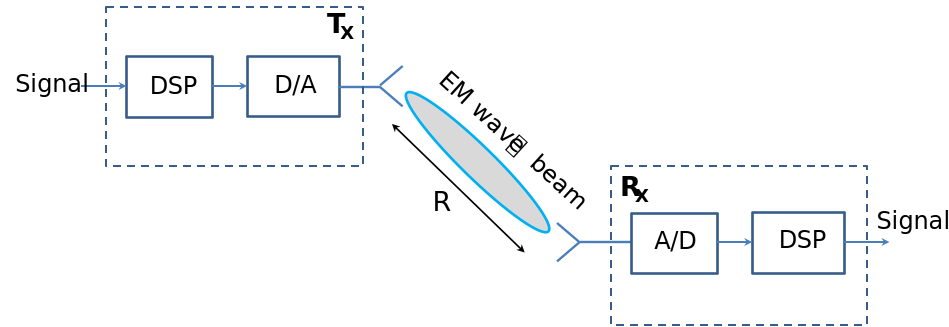
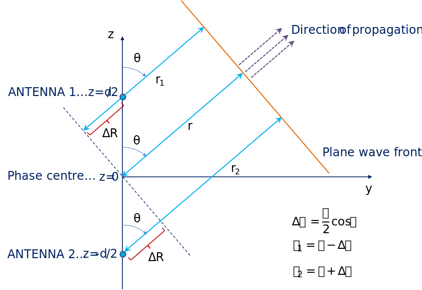
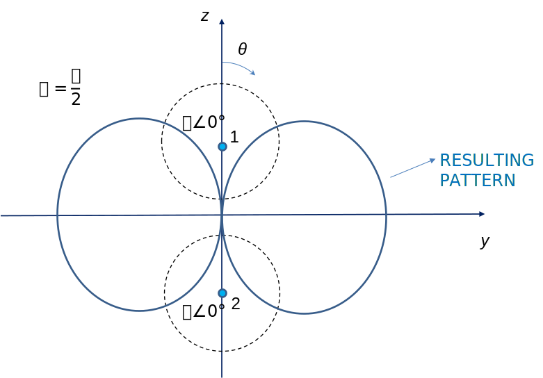
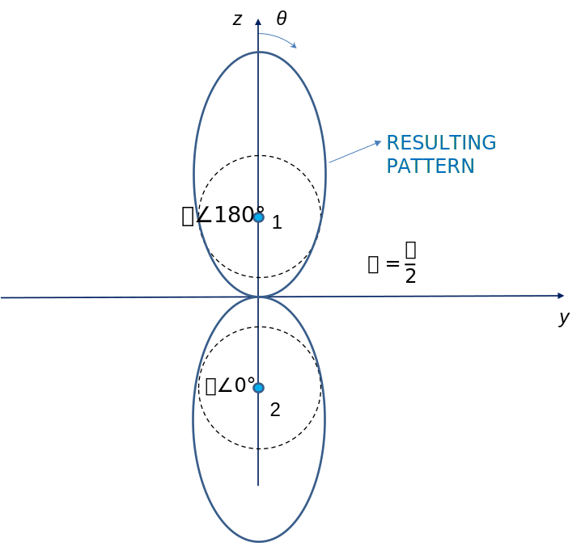
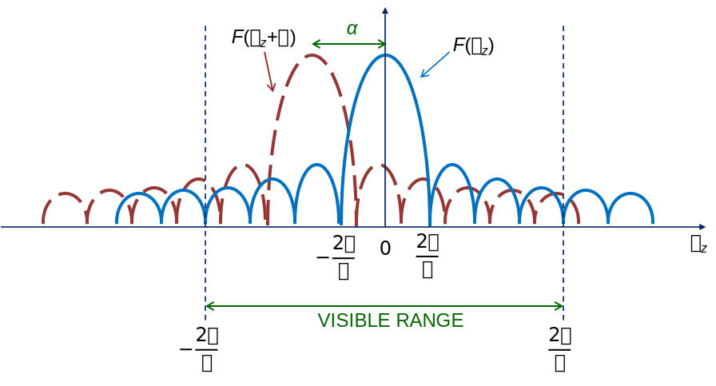
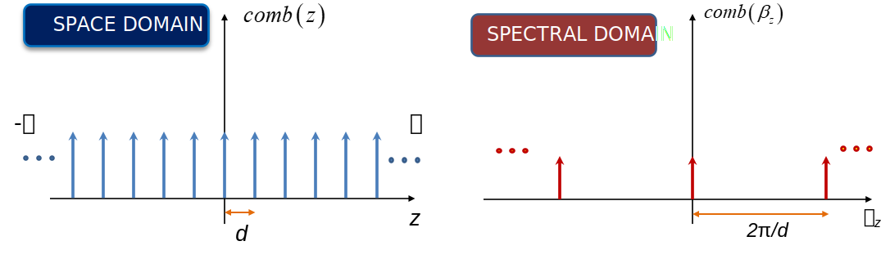
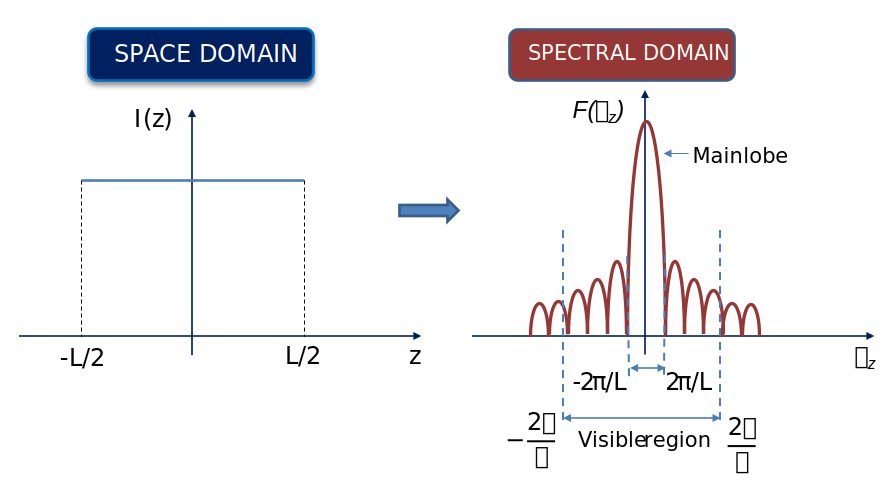
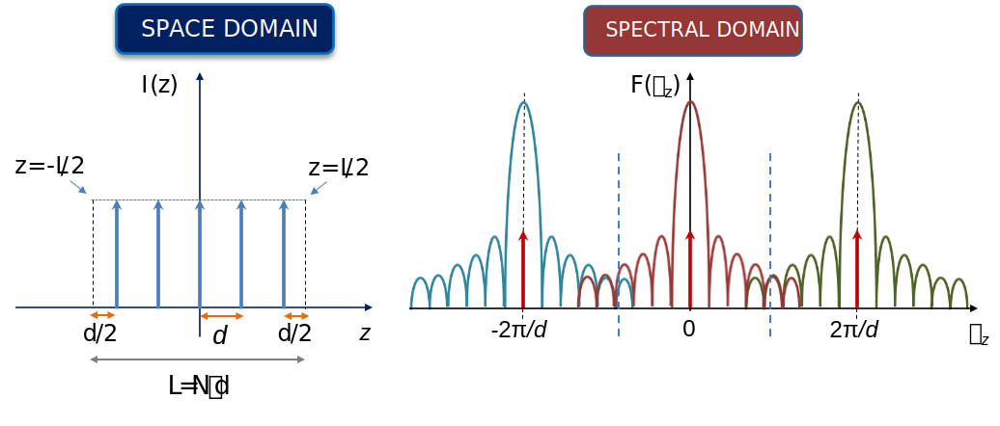
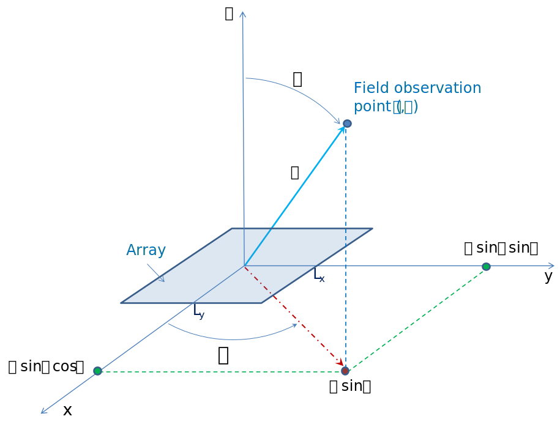
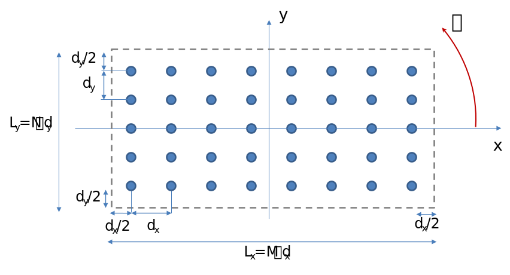

Antenna Arrays
===================================

Consider a simplified point-to-point wireless link, consisting of transmitting (TX) and receiving (RX) points in space. Connection is achieved using electromagnetic waves in free space. Antennas are used to ensure efficient signal transmission between two points. Ideally, the radiated signal from the TX antenna would be focused into a narrow beam that would be directed towards the RX point. The goal is not to waste energy by radiating into directions at which it is not needed.

When designing antennas, two principal questions need to be answered to create a narrow, highly directive beam:

#. How to create a narrow beam?
#. How to control (steer) the beam shape and direction in time?

The answer to the first question is to have a large radiating structure -- antenna -- in terms of wavelength. A general rule is “the larger the antenna, the narrower the beam”. As for the second question, one can control the beam mechanically, simply by rotating the antenna, or electronically, by designing a spatial current distribution that provides the desired radiating beam. The latter is achieved by discretizing the radiating structure into multiple antenna elements which then form a composite antenna, i.e. an **antenna array**.

To achieve a desired current distribution along the antenna array, each antenna element shall be fed by its own amplifier and phase shifter. These will be electronically controlled, and the designer will be able to change an amplitude taper and phase shift at each antenna element in real time. This process is referred to as **beamforming**, as the applied current distribution on an antenna array will give rise to a specific beamforming pattern in the farfield of the antenna system. The use of antenna arrays and electronic steering provides large flexibility and speed in controlling the antenna beam and is of particular interest in modern wireless communication systems. Here we present basic aspects of antenna arrays and explore how antenna design meets digital signal processing in the field of antenna arrays.

  Fig. 1. A point-to-point wireless link connected via a narrow beam.

   ..

Two-element Arrays
-------------------

If we observe a single antenna at a farfield distance *r*, we can express the electric field it generates as

.. math::
   \mathbf{E(r)}=E_0e^{j\alpha}\cdot\frac{e^{-j\beta r}}{r}\cdot\mathbf{F}\left(\theta,\varphi\right) 

The field has its amplitude :math:`{E_0}` and phase :math:`\alpha`, which depend on antenna excitation. Free space wavenumber :math:`\beta=\frac{2\pi}{\lambda}` is expressed in [rad/m].

The simplest possible array is the one consisting of two antenna elements placed at some distance *d*. For convenience, we assume that the antennas are places along the *z* axis, symmetrically around :math:`z=0`, as shown in Fig. 2. One of key assumptions of farfield observation is that we can observe the incoming electromagnetic wave as a plane wave. Analyzing for observation direction :math:`\theta`, we find the total electric field to be a superposition of fields generated by the two antenna elements that make up the array.

  Fig. 2. Farfield geometry for a two-element array

   ..

With these considerations and the geometry in Fig. 2, we can now present the resulting field of a two element array. If all elements are excited with currents of equal amplitudes :math:`E_0`, but with a phase difference :math:`\alpha` between the two elements, the field is expressed as

.. math::
   \mathbf{E}=\mathbf{E}_\mathbf{1}+\mathbf{E}_\mathbf{2}=E_0\cdot\frac{e^{-j\beta r}}{r}\cdot\mathbf{F}\left(\theta,\varphi\right)\cdot\left(e^{+j\beta\frac{d}{2}\cos{\theta}}e^{+j\alpha}+e^{-j\beta\frac{d}{2}\cos{\theta}}\right)

The term in brackets on the right side containing two exponential functions is termed **array factor** and is crucial in defining the total array pattern. We can rewrite general relation for resulting field as

.. math::
   \mathbf{E}_{total}\left(r,\theta,\varphi\right)=E_0\cdot\frac{e^{-j\beta r}}{r}\cdot\mathbf{F}\left(\theta,\varphi\right)\cdot AF\left(\theta,\varphi\right)

The total radiation pattern of an antenna array depends **both** on

- the radiation pattern of a constituent antenna element :math:`\mathbf{F}\left(\theta,\varphi\right)`, and
- the array factor :math:`AF\left(\theta,\varphi\right)`.

The array factor itself is independent of the nature of the elements of the array. It only characterizes their geometrical relation in the array and the relation between their excitations. Therefore the point of interest in array design is how to geometrically distribute antennas in space and what kind of signal to bring to each antenna element. The design of the array factor provides large versatility of possible radiation patterns of the resulting array. 

Examples of Two-element Arrays
^^^^^^^^^^^^^^^^^^^^^^^^^^^^^^^

Broadside array
   ..

The simplest case of an array is the one in which two identical antennas have the same magnitude and phase of excitation, i.e. when :math:`\alpha=0`. The resulting normalized field is then obtained as

.. math::
   \mathbf{E}=\frac{e^{-j\beta r}}{r}\cdot\mathbf{F}\left(\theta,\varphi\right)\cdot2\cdot \cos{\left(\frac{\beta d}{2}\cos{\theta}\right)}

In particular, if we put :math:`d=\lambda/2` (case of particular interest), we get

.. math::
   \mathbf{E}=\frac{e^{-j\beta r}}{r}\cdot\mathbf{F}\left(\theta,\varphi\right)\cdot2\cdot 	\cos{\left(\frac{\pi}{2}\cos{\theta}\right)}

What can be concluded from this formula?
- Maximum radiation occurs is in direction :math:`\theta=90^{\circ}`. Such array is called **broadside array**. In addition, for :math:`d=\lambda/2` zeros in radiation pattern occur at directions :math:`\theta=0^{\circ}` and :math:`\theta=180^{\circ}`.
- By having two identical sources in space, we modify the radiation pattern of a single antenna.

   Fig. 3. Broadside pattern of a two-element array with :math:`d=\lambda/2`. Elements are assumed isotropic.

   ..

End-fire array
   ..

We now consider what happens when we excite one of the antenna elements counterphase to the other. Magnitude of excitations remains equal. The resulting field is

.. math::
   \mathbf{E}=\mathbf{E}_\mathbf{1}+\mathbf{E}_\mathbf{2}=\frac{e^{-j\beta r}}{r}\cdot\mathbf{F}\left(\theta,\varphi\right)\cdot\left(e^{-j\beta\frac{d}{2}\cos{\theta}}e^{j\pi}+e^{+j\beta\frac{d}{2}\cos{\theta}}\right)

which can be written as

.. math::
   \mathbf{E}=\mathbf{E}_\mathbf{1}+\mathbf{E}_\mathbf{2}=\frac{e^{-j\beta r}}{r}\cdot\mathbf{F}\left(\theta,\varphi\right)\cdot2j\cdot \sin{\left(\frac{\beta d}{2}\cos{\theta}\right)}

Direction of maximum radiation is :math:`\theta=0^{\circ}`. Such array is called **end-fire array**. In addition, if we assume that :math:`d=\lambda/2` zeros in the radiation pattern are observed for direction :math:`\theta=90^{\circ}`.

   Fig. 4. End-fire pattern of a two-element array with :math:`d=\lambda/2`. Elements are assumed isotropic.

   ..

General two-element array with uniform magnitude
   ..

For an arbitrary phase shift between the excitations of two antenna elements :math:`\alpha`, array factor is determined as

.. math::
   AF\left(\theta,\varphi\right)=AF\left(\theta\right){=e}^{+j\beta\frac{d}{2}\cos{\theta}}e^{j\alpha}+e^{-j\beta\frac{d}{2}\cos{\theta}}

Radiation maximum in the direction for which the interference of fields generated by two antenna elements is constructive, i.e. when the two exponentials in array factor are equal. The condition turns to be

.. math::
   \alpha=-\beta d\cos{\theta}+2n\pi 

On the other hand, zeros in the radiation pattern occur in the direction for which the interference of the fields is destructive, i.e. when the array factor is zero.

.. math::
   \beta d\cos{\theta}=\pi-\alpha+2n\pi

For a given array, we can modify the direction :math:`\theta` of maximum and minimum by merely changing the excitation phase :math:`\alpha`. This can be done electronically, using a variable phase shifter. This is the basic principle of beamforming, and shows the main advantage of arranging antennas into arrays. An additional degree of freedom is enabled when we allow the magnitude of excitation to change between elements as well.

Linear Arrays
--------------

Considerations made for two-element arrays can now be extended to linear arrays with *N* elements. In all analyses that we present here, we will assume that all antenna elements are uniformly spaced spaced at some distance *d*. This is the most common approach in array design. We also assume that the linear array is oriented in *z* direction. Each antenna element *n* is excited with current magnitude :math:`I_n` and phase :math:`\alpha_n`. For such an array, array factor is expressed as

.. math::
   AF\left(\theta\right)=\sum_{n=0}^{N-1}I_n\cdot e^{j\alpha_{n}} e^{j\beta_{z} z_{n}}

Here :math:`\beta_z=\beta \cos{\theta}=\frac{2\pi}{\lambda}\cos{\theta}` is the wavenumber in *z* direction (acting as a spatial frequency) while :math:`z_n=n\cdot d` are the relative coordinates of *n*-th element. For linear array the array factor is dependent on only one spatial angle determined by array axis (:math:`\theta`), so with linear arrays we can in general modify the element radiation pattern only in one principal plane.

Of particular interest are arrays excited with equal magnitudes :math:`I_0` and phases that progress linearly across the array as :math:`\alpha_n=n \cdot d \cdot \alpha`. The array factor is then obtained as geometric series

.. math::
    AF\left(\theta\right)=I_0\sum_{n=0}^{N-1}  e^{j n \left (\beta_{z}+\alpha \right )\cdot d }=I_0\sum_{n=0}^{N-1}  e^{j n \psi}

i.e.

.. math::
    AF\left(\psi\right)=I_0 e^{j \frac{\left ( N-1 \right )\cdot \psi}{2}} \cdot \frac{\sin \left ( \frac{N\psi }{2} \right )}{\sin \left ( \frac{\psi }{2} \right )}

Note that linear rate of phase change :math:`\alpha` only changes the direction of maximum. A radiation maximum is observed for direction :math:`\psi =0`. In that case, :math:`AF\left(\psi=0\right)=N\cdot I_0`. In other words, maximum radiating field intensity in that direction is increased *N* times compared to having a single antenna. The main beam is sharper in shape, and directivity is increased.

Designing Linear Arrays
^^^^^^^^^^^^^^^^^^^^^^^^

To construct an antenna array, given the desired direction of main beam (i.e. array factor), one starts by analyzing the equivalent line current distribution that gives rise to the radiation pattern. The array represents the discretization of that current distribution. We can assume that such current distribution is placed along the *z* axis, and that its length is *L*. The far-field radiation pattern from this current is then given as a *radiation integral*

.. math:: 
   F \left(\beta_z\right)= \int_{-\infty}^{\infty} {I\left(z \right)e^{j\beta_z } dz}

Analogously, current distribution can be found as

.. math::
   I\left(z\right)=\frac{1}{2\pi}\cdot\int_{-\infty}^{\infty}F \left (\beta_z \right )e^{-j\beta_z z}d\beta_{z}

Note that the current distribution :math:`I \left( z \right)` and its far-field radiation pattern ("space factor") :math:`F \left(\beta_z\right)` are related via Fourier transformation. The spectral variable :math:`\beta_z` is furthermore directly mapped to angle :math:`\theta` which represents the observed direction in far field via relation :math:`\beta_z=\beta \cdot \cos \left( \theta \right)`. These properties are the basis of array design.

Uniform Current Distribution
   ..

If the amplitude and phase of current :math:`I \left( z \right)` are both constant along line, then the radiation pattern is of the form of the *sinc* function (i.e :math:`\frac{sin x}{x}`):

.. math::
   F \left(\beta_z\right)= I_{0}\int_{-L/2}^{L/2}  e^{j\beta_z z}dz\ = I_{0} L\cdot  \frac{\sin \left ( \frac{\beta_z L }{2} \right )}{\frac{\beta_z L }{2} }

The radiation maximum (main beam) now occurs for :math:`\beta_z=0`, which corresponds to the broadside direction :math:`\theta=90^{\circ}`. Zeros in the radiation pattern occur where for some integer *n* the spectral variable :math:`\beta_z` equals :math:`\frac{n\cdot 2 \pi}{L}`, i.e. at angles for which :math:`\cos \theta = n\cdot  \frac{\lambda }{L}`. Therefore the length of the line current *L* determines the width of the beam.

Here we can note that:

#. In digital signal processing the analog to a uniform line source in space would be rectangular pulse (or window) of duration *T*. The radiation pattern in this case could correspond to a frequency response of a digital low-pass filter.
#. To alter the beam shape and sidelobe level one can additionally modify the current distribution by means of various windowing functions available in digital filter design.
#. Although :math:`F \left(\beta_z\right)` extends to infinity in mathematical terms, radiation pattern is relevant only for :math:`\theta \in \left [ 0,\pi  \right ]`. This corresponds to the demand that :math:`\beta_z` extends from :math:`-\beta` to :math:`\beta`. This region is called **visible region**. As we are interested in :math:`F \left(\beta_z\right)` only in visible region, in array design we have some freedom to modify this function in its invisible region to achieve physical realizability.

Linear Phase Progression
   ..

Now we assume that the equivalent line current :math:`I \left( z \right)` is of the form:

.. math::
   I \left( z \right)=I_{0}\cdot{e}^{j\alpha z} 

This means that the magnitude of the current distribution remains constant, but the phase progresses linearly with rate :math:`\alpha` across the length of the line. The radiation pattern is then proportional to

.. math:: 
   F \left(\beta_z\right)= \int_{-\infty}^{\infty} {I_{0}e^{j\alpha z}\cdot e^{j\beta_z z}dz}=F \left(\beta_z + \alpha\right)

This leads to a shift of the main beam to some angle :math:`\theta_{0}=\arccos \left ( \frac{\alpha}{\beta  } \right )`. The added phase shift needs to ensure that :math:`\theta_{0}` is between :math:`-\pi` and :math:`\pi`. This procedure is called **beam steering**, and represents the basis for beamforming.

   Fig. 5. Broadside radiation pattern and shifted radiation pattern due to linear excitation phase :math:`\alpha` 

   ..

Discretization
"""""""""""""""""
The line current distribution we've analyzed so far is continuous. To build an antenna array with such current distribution, we must discretize it at points where we plan to place antenna elements. We sample the line current :math:`I \left( z \right)` at distances :math:`n \cdot d`, which corresponds to antenna element position within the total array length *L*. For discretization we use the *comb* function (Fig. 6), which is a train of Dirac impulses.

.. math::
   comb\left(z\right)=\sum_{n=-\infty}^{\infty}\delta\left(z-n\cdot d\right)

This function has a Fourier transform which is another (reciprocal) comb function with spacing between elements :math:`2\pi /d`:

.. math::
   comb\left(\beta_z\right)=\frac{1}{d}\sum_{n=-\infty}^{\infty}\delta\left(\beta_z-\frac{2\pi n}{d}\right)

   Fig. 6. Comb function 

   ..

The discretized current is obtained by taking the values of the continuous current at each distance *d*.  

.. math::
   I\left(z\right)=\sum_{n=-\infty}^{\infty}{I_n\left(z\right)\delta\left(z-nd\right)}

Multiplication with comb function in spatial domain translates to a convolution of current spectrum with the reciprocal comb function in spectral domain:

.. math::
   F\left(\beta_z\right)=F\left(\beta_z\right)\ast\frac{1}{d}\sum_{n=-\infty}^{\infty}\delta\left(\beta_z-\frac{2\pi n}{d}\right)=\frac{1}{d}\sum_{n=-\infty}^{\infty}F\left(\beta_z-\frac{2\pi n}{d}\right)

For rectangular uniform current distribution discretized with *N* intervals at a distance *d*, this convolution becomes the *array factor* expressed as dependency on :math:`\theta`:

.. math::
   AF\left ( \theta  \right )=F\left ( \beta_z \right )  =I_0 \cdot N \cdot \frac{\sin \left ( \frac{N \cdot \beta_z\cdot d }{2} \right )}{N \cdot\sin \left ( \frac{\beta_z\cdot d }{2} \right )}

.. note::
   **The used convention in discretization**

   The element with index 0 is chosen to be placed at position :math:`z=-L/2+d/2`, while the element with index (*N*-1) is placed at :math:`z=L/2-d/2` for convenience (Figs 7 and 8). That way number of samples *N* is equal to number of sampling intervals, and the total line current length *L* is equal to :math:`N\cdot d`.

If we wish to steer the beam to some direction other than broadside we introduce linear phase shift to *n*-th element as :math:`\alpha_n=n \cdot d \cdot \alpha`. Then we can also introduce auxiliary variable :math:`\psi=\left(\beta_z+\alpha\right )\cdot d`. With that the above expression basically becomes the same one as already derived intuitively when linear arrays were first introduced.

The array factor can also be obtained via discrete Fourier transform from the (known) magnitudes and phases of current samples :math:`i_n` at the antenna elements:

.. math::
   AF\left ( \theta  \right ) =  \sum_{n=0}^{N-1} i_n \cdot e^{j \beta_{z}\cdot  nd}

The discretization process is described qualitatively in Figures 7 and 8. Note that the spectrum of the array factor is periodic with a period proportional to 1/*d*. Additional main lobes appearing in spectral domain are also termed **grating lobes**.

As in digital signal processing, aliasing can occur if the array elements are too distant, which is analogous to the sampling frequency being too low. Aliasing manifests itself in radiation pattern as possible appearance of grating lobes within the visible region and occurs when :math:`d> \frac{\lambda }{2}`. In array design aliasing however does not always mean to be a bad thing as in signal processing, since grating lobes may be sometimes desired (e.g. in interferometers). Here we however consider cases with no aliasing, for simplicity and compatibility with DSP. When no aliasing occurs, in visible region the array factor corresponds to the one obtained for equivalent line current.

   Fig. 7. Continuous current line source and spectrum

   ..

   Fig. 8. Discretized current line source and spectrum

   ..

Planar Arrays
--------------

Linear arrays with uniform element spacing are rather straightforward to analyze and design since they rely on Fourier transform relationship between current distribution (space domain) and array factor (spectral domain), which opens the door for direct use of various digital signal processing techniques through analogies with Fourier transform relations between time and frequency domains. Nevertheless, they have the property of beam steering in only one principal plane; the one defined by array axis, which we assumed above to be *z*. In the orthogonal planes radiation pattern remains identical to that of a single antenna element. 

When 3D beam coverage is required antenna elements need to be distributed in two dimensions, i.e. on a plane. The simplest 2D array geometry is a planar array with rectangular grid. It can be considered as a (linear) array of linear arrays, and its array factor is the product of two linear array factors. The design procedure of such an array boils down to design of two linear arrays in two planes.

The design of planar arrays can also be considered as a discretization of some 2D excitation distribution in a similar way linear arrays are considered as a discretization of line source. Here we take a look at basic properties of 2D array and address its geometry and design aspects.

We will assume that the planar array extends in *xy* plane. The starting relation is now a 2D Fourier transform relating excitation distribution :math:`I\left(x,y \right)` and space factor :math:`F \left(\beta_x,\beta_y\right)`.

.. math::
   F \left(\beta_x,\beta_y\right)= \int_{-\infty }^{-\infty}\int_{-\infty }^{-\infty} {I\left(x,y \right)e^{j\beta_x x + j\beta_y y} dxdy}

If we assume that the analyzed surface is rectangular with dimensions :math:`L_x \times L_y` the Fourier transform boils down to the product of two Fourier transforms in *x* and *y* directions.

.. math::
   F \left(\beta_x,\beta_y\right)= F_x \left(\beta_x\right)\cdot  F_y \left(\beta_y\right) = \int_{-L_{x}/2 }^{L_{x}/2} {I\left(x \right)e^{j\beta_x x } dx} \cdot \int_{-L_{y}/2 }^{L_{y}/2} {I\left(y \right)e^{j\beta_y y } dy}

We can apply the same reasoning as in the one-dimensional case and observe the planar array as two linear arrays in *x* and *y* directions. Spectral variables :math:`\beta_x` and :math:`\beta_y` are now projections of a planar wave in some direction **r** onto *x* and *y* axes respectively, and are given as

.. math:: 
   \beta_x=\beta \sin{\theta} \cos{\phi}=\frac{2\pi}{\lambda}\sin{\theta} \cos{\phi}

.. math:: 
   \beta_y=\beta \sin{\theta} \sin{\phi}=\frac{2\pi}{\lambda}\sin{\theta} \sin{\phi}

Discretization of the planar surface is done using *M* elements in *x* direction and *N* elements in *y* direction. The total array factor across the farfield sphere :math:`AF\left ( \theta ,\varphi  \right )` is then the product of two array factors obtained using spectral variables :math:`\beta_x` and :math:`\beta_y`. In two principal orthogonal planes :math:`y=0` and :math:`x=0` (i.e. :math:`\phi=0^{\circ }` and :math:`\phi=90^{\circ}`) array factors correspond to equivalent line sources in *x* and *y* directions. Thus they can be evaluated independently using procedures for linear arrays. In all other planes the product of two patterns is used. The resulting beam possesses 3D capabilities as it extends across both :math:`\theta` and :math:`\phi` angles on the farfield sphere. The visible region in spectral domain becomes a unit circle

.. math::
   \beta_x^{2}+\beta_y^{2}=\sin ^{2}\left ( \theta \right )\cdot 1\leq 1

The relevant geometry of planar arrays is provided in Figs 9 and 10 as follows:

   Fig. 9. Planar array in *xy* plane. 3D view.

   ..

   Fig. 10. Planar array in *xy* plane. 2D view.

   ..

.. note::
   Some analogies between digital signal processing and array design are provided in table below.

   ====================================================                 ==================================================
   Signal processing                                                     Antenna array processing
   ====================================================                 ==================================================
   Time coordinate ... *t*                                              Space coordinate ... *z* 
   Frequency ... :math:`\omega`                                         Wavenumber ... :math:`\beta_z`  
   Sinusoid ... :math:`e^{j \omega t}`                                  Plane wave ... :math:`e^{-j \beta_z z}`
   Sampling ... :math:`T_{s}\leq \frac{1}{2f_{max}}`                    Sampling ... :math:`d\leq \frac{\lambda}{2}`
   Mixing/modulation... :math:`F(\omega -\omega _{0})`                  Beam steering ... :math:`F(\beta_z -\alpha)`  
   ====================================================                 ==================================================

Related Assignments
--------------------
This chapter is accompanied by a demo example :ref:`From Antennas to Arrays <antennas-example>`.
