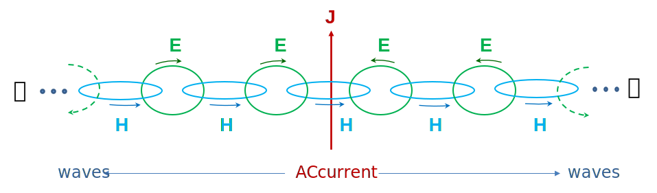
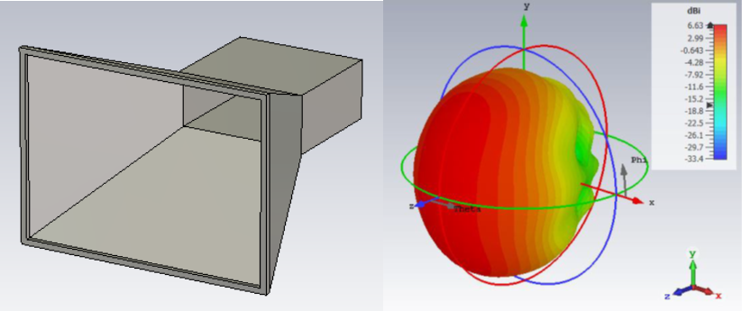
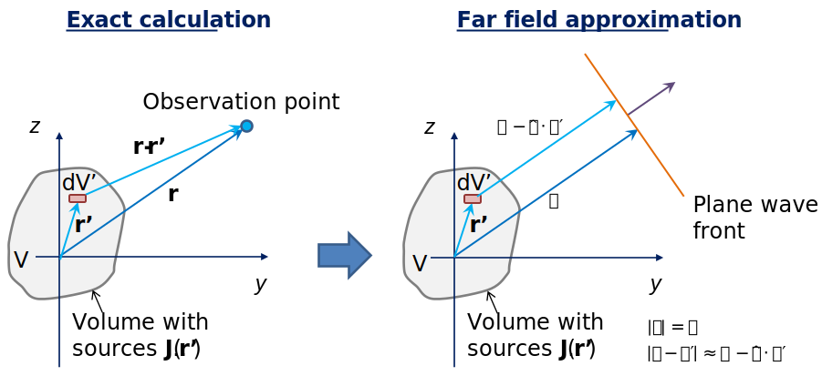
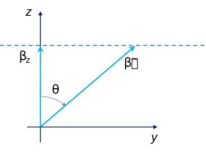

Basics of Antennas
=======================

Introduction to Antennas
^^^^^^^^^^^^^^^^^^^^^^^^^^^

Since the 19th century series of experiments (but also before), it has been known that electric charges and currents couple electric and magnetic energy into space around it, giving rise to electric and magnetic fields. For the transmission of electromagnetic energy to large distance from sources, of most interest is a type of fields termed **radiating fields**. These fields decay with distance from source *R* as *1/R*, which is the “slowest” observed spatial decay of fields in 3D space.

Such dependency is a distinctive characteristic of radiating fields by which they differ from other types of fields coupled into space by sources. Other fields, such as static and quasi-static, decay at a rate of, :math:`1/R^2`, :math:`1/R^3`, etc. Therefore, radiating fields prevail in the total field in regions far away from the source. 
In addition, they propagate through space like waves, where time-varying electric and magnetic fields are interplayed by creating each other throughout space, as shown in Fig. 1. These electromagnetic waves travel through free space at the speed of light, which is approximately :math:`c=3 \cdot 10^8` m/s.

  Fig. 1. A very simplified illustration of radiation mechanism.

   ..

The radiating fields are proportional to the **acceleration of charge**, which corresponds to the time derivation of current. Thus, having an alternating (AC) current is a necessary condition for the creation of radiating fields. This in turn means that basically any device (or structure) with AC current would produce radiating fields. As stated earlier, radiating fields are not the only type that exist. To be sure that we can ignore other field types, either

- the radiating structure has to be large enough, or
- we must move far enough from the source.

An **antenna** is a device that efficiently radiates and receives electric and magnetic fields in space.

Wavelength and Frequency
^^^^^^^^^^^^^^^^^^^^^^^^^

When we say *large enough* and *far enough*, we mean this in terms of wavelength of the electromagnetic wave (sinusoidal waves are assumed). This leads us to the formula relating wavelength and frequency of operation in free space:

.. math::
   \lambda =\frac{c}{f}

Now, in terms of wavelength, we can find that efficient coupling of electromagnetic energy into radiating fields occurs when device dimension *D* is comparable to \lambda, while the full effect of radiating fields is observable at distances much larger than wavelength (:math:`R \gg \lambda`). In that case we can say that we are in the **far field** of the antenna. Several engineering criteria for near-to-far field boundary (:math:`R_{FF}`) are available in literature, however in antenna engineering the most common one (valid for most common types of antennas) is:

.. math::
   R_{FF}  = \frac{{2\cdot D}^2}{\lambda}

To illustrate the matter, we show some frequencies of interest and their corresponding wavelengths (see table below). Contemporary microwave communications are mostly in the range from around 300 MHz up to around 30 GHz (the spectrum is to be extended to higher frequencies in the future), which gives rise to wavelengths measured in millimeters and centimeters. As a rule of thumb it is useful to remember that 300 MHz in frequency corresponds to 1 m in wavelength.
   
+---------------------+-------------------------+----------------------+
|  Frequency          |  Wavelength             |  Application         |
+=====================+=========================+======================+
|  50 Hz              |  6000 km                |  AC current network  |
+---------------------+-------------------------+----------------------+
|  300 MHz            |  1 m                    |  UHF communications  |
+---------------------+-------------------------+----------------------+
|  2.4 GHz            |  12.5 cm                |  WiFi                |
+---------------------+-------------------------+----------------------+
|  30 GHz             |  10 mm                  |  5G - high band      |
+---------------------+-------------------------+----------------------+
|  193.5 THz          |  1550 nm                |  Optical (infrared)  |
|                     |                         |  communications      |
+---------------------+-------------------------+----------------------+
|  500 THz            |  600 nm                 |  Visible light       |
|                     |                         |  (orange color)      |
+---------------------+-------------------------+----------------------+

By considering frequency-to-wavelength relations one can also note that some structures, such as a coiled wire (Fig. 2), can at the same time be considered both as an inductor (if the frequency of operation is say 50 Hz) and as antenna (at the frequency of say 400 MHz).

It is the size in wavelength that matters!

  Fig. 2. Coiled wire – Depending on frequency it can either be an inductor or an antenna

   ..

Spatial Distribution of Fields
^^^^^^^^^^^^^^^^^^^^^^^^^^^^^^^^^^^^^^^^^^^^^^^^^^^^^^^^^^^^^

Efficient antenna design needs to address several basic questions:

#.	How to efficiently couple electromagnetic energy into radiating fields at the given frequency?
#.	How to radiate energy in the desired direction and suppress radiation in the undesired direction?
#.	How to conform the antenna to the environment (i.e. operating device) to not make it obtrusive?

Given that any wireless communication device, system or sensor needs an antenna, and that there is a myriad of possible operating environments, these questions are the principal reason why we have so many different types of antennas today. The answers to the above questions are germane to the “art” of antenna design.
If we (for now) assume that we have obtained efficient energy coupling from the antenna into radiating fields, we turn our attention to how radiating fields (and energy) are distributed in space. 

Radiation Pattern, Directivity and Gain
""""""""""""""""""""""""""""""""""""""""

Analysis of spatial properties of radiating fields is typically done in spherical coordinate system :math:`\left(r, \theta,\varphi\right)`, with antenna in its origin. We are interested in the angular :math:`\left(\theta,\varphi\right)` distribution of radiated power density (or fields) at a sphere on some large distance from the antenna (:math:`R \gg \lambda`), where radiating fields dominate over all other fields. This spatial distribution is presented by the antenna radiation pattern, which can be displayed in 3D or (more often) in principal planes (2D).

  Fig. 3. Example of a horn antenna and its 3D radiation pattern

   ..

As a reference, we use a so-called isotropic antenna, which radiates equally in all directions in space. Total radiated power (TRP) of an isotropic antenna is equally distributed across the surface area of a large sphere with radius *R*, giving rise to power density *S*:

.. math::
   S_\textrm{isotropic}=\frac{\textrm{TRP}}{4\pi R^2}\ \mathrm{\left[\frac{W}{m^2}\right]}

.. note::
   Power density is proportional to field intensity-squared. So, for fields decaying with :math:`1/R`, power density decays as :math:`1/R^2`.

However, an isotropic antenna does not exist in practice. For any practical antenna, radiated power density is larger in some spatial directions, and smaller in other. Isotropic power density thus merely represents an average radiated power density. To characterize the spatial distribution of antenna's radiated power, we introduce a quantity named **directivity**, which is defined as the actual power density normalized to the (hypothetical) isotropic power density:

.. math::
   D\left(\theta,\varphi\right)=\frac{S\left(\theta,\varphi\right)}{S_\textrm{isotropic}}

Alongside directivity, another parameter that describes the radiation properties of an antenna is **gain**, which also takes into account losses in the antenna structure (expressed via radiation efficiency :math:`\eta`) which arise due to dissipation of power in metals or dielectrics. For lossless antennas (often considered in analysis as a first approximation) directivity and gain are equal.

.. math::
   G\left(\theta,\varphi\right)=\eta\cdot D\left(\theta,\varphi\right)

Although both directivity and gain are functions of direction :math:`\left(\theta,\varphi\right)`, we conventionally observe the direction of maximum radiation intensity when characterizing an antenna. That way, we have one number to characterize antenna properties. We can also note that by focusing radiated power into some desired direction we obtain a *beam*, and with that larger power density and “better” wireless link in that direction. These points are further illustrated in Fig. 4:

.. figure:: _img/antennas1/F4_patterns.svg

  Fig. 4. Comparison of isotropic and directive antenna radiation patterns

   ..

Far-Field Calculations
^^^^^^^^^^^^^^^^^^^^^^^^

We now provide a glimpse into calculations of electromagnetic field in space. This would allow us to generalize the procedure of array design and get an insight into how far fields are calculated as a spatial response to the sources. The sources of electromagnetic fields in space are time-varying currents and charges (the latter can be expressed via currents for sinusoidal excitation). Current densities **J** generate vector potential **A** (also sometimes called *electromagnetic momentum*), which eventually gives rise to fields in space (**E** and **H**). Introducing potentials as an intermediate step in field calculation from sources is a standard procedure in antenna analysis. 

Of practical interest here is to put focus on potentials and fields at large distances from the antenna (i.e. on radiating fields), where equations simplify considerably.

The starting equation is the **radiation integral**, which relates current density distribution **J** and vector potential **A** in space. It is derived directly from Maxwell’s equations:

.. math::
   \mathbf{A}\left(\mathbf{r}\right)=\mu\cdot\int_{V}{\mathbf{J}\left(\mathbf{r}'\right)\frac{e^{-j\beta\left|\mathbf{r}-\mathbf{r}'\right|}}{4\pi\left|\mathbf{r}-\mathbf{r}'\right|}dV'} 

Here, :math:`\left|\mathbf{r}-\mathbf{r}'\right|` is the distance from observation point **r** to source point **r’**, while :math:`\beta=\frac{2\pi }{\lambda }` is the free space wavenumber. Integration is performed over volume *V* in which :math:`\mathbf{\mathrm{J}}(\mathbf{r}')\neq 0` for all source points **r’** (i.e. volume elements *dV’*), while each source point introduces a phase delay :math:`e^{-j\beta\left|\mathbf{r}-\mathbf{r}'\right|}` to the observation point.

  Fig. 5. Near field vs. far field geometry

   ..

Introducing so-called *far-field approximations* results in simplified version of the radiation integral:

.. math::
 \mathbf{A}\left(\mathbf{r}\right)=\mu\cdot\frac{e^{-j\beta R}}{4\pi R}\int_{V}{\mathbf{J}\left(\mathbf{r}'\right)e^{j{\boldsymbol{\overset{\sim }{\beta}}}\cdot\mathbf{r}'}dV'}

The integral part of the above term is the spatial (3D) Fourier transform of current distribution on the antenna and is also termed *space factor* and denoted as :math:`\mathbf{F}\left({\boldsymbol{\widetilde{\beta }}}\right)=\mathbf{F}\left ( \beta \hat{\mathbf{r}} \right )`. The building blocks in this transform are the **plane waves** in various directions :math:`\hat{\mathbf{r}}`, which are in spherical coordinates described by angular pair :math:`\left(\theta,\varphi\right)` representing elevation and azimuthal angle, respectively. The far-field electric and magnetic fields derived from vector potential are generally proportional to :math:`\theta` and :math:`\varphi` components of the space factor.

Simplifications for Linear Antennas
""""""""""""""""""""""""""""""""""""

To visualize the properties of the space factor and its role in radiation pattern calculations it is interesting to consider the linear antenna, where the volume integral reduces to a line integral, while 3D spatial Fourier transform reduces to 1D. We consider a finite line source placed along the *z* direction and *L* in length, containing current  :math:`I\left(z^\prime\right)`. The space factor :math:`\mathbf{F}\left({\boldsymbol{\widetilde{\beta }}}\right)` is then reduced to:

.. math:: 
   \mathbf{F}\left({\boldsymbol{\widetilde{\beta }}}\right)\equiv \mathbf{\hat{z}}\cdot F \left(\beta_z\right)= \mathbf{\hat{z}}\cdot\int_{L}{I\left(z^\prime\right)e^{j\beta_zz^\prime}dz^\prime}

Here we introduced :math:`\beta_z=\boldsymbol{\widetilde{\beta }}\cdot\hat{\mathbf{z}}=\beta \cos{\theta}`. This is the is the wavenumber in *z* direction (Fig. 6), and describes the projection of the plane wave in the observed general direction :math:`\hat{\mathbf{r}}` onto *z*- axis (this is the axis containing sources in this case). Note that in this case the direction :math:`\hat{\mathbf{r}}` has assigned to it only one spatial angle :math:`\theta` that is relevant to the space factor, which means that the space factor for line sources acts only in one (elevation) plane.

   Fig. 6. Wavenumber in *z*-direction 

   ..

Current distribution is then given as inverse Fourier transform of :math:`F \left(\beta_z\right)`:

.. math::
  I\left ( z^\prime \right )=\frac{1}{2\pi}\cdot\int_{-\infty}^{\infty}F \left (\beta_z \right )e^{-j\beta_zz^\prime}d\beta_{z}

Therefore, to determine the far field radiation pattern one needs to perform spatial Fourier transformation of source distribution and thereby find the vector potential :math:`\mathbf{A(r)}`, from which the fields follow using standard vector analysis procedures. For line sources, magnitudes of radiating **E** and **H** fields are proportional to space factor :math:`F\left(\beta_z\right)`.
