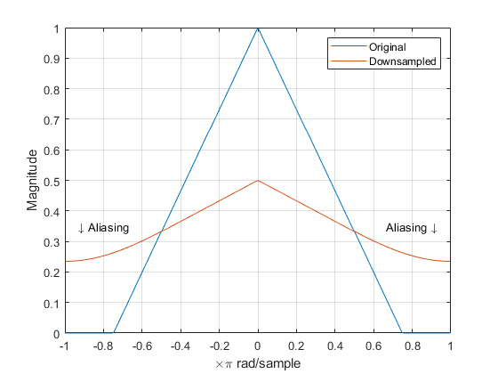
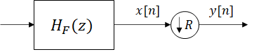
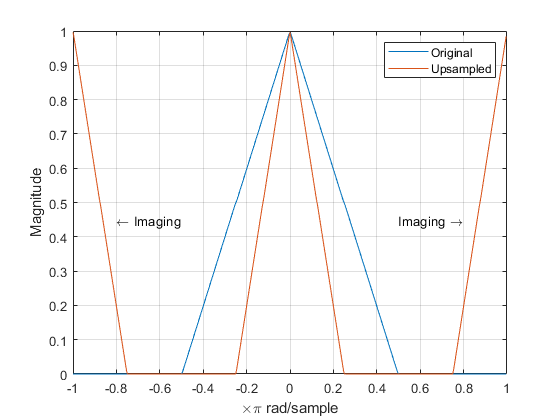
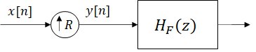

Multirate Signal Processing
========================================================

In multirate digital signal processing the sampling rate of a signal is changed in order to increase the efficiency of various signal processing operations. Decimation, or
down-sampling, reduces the sampling rate, whereas expansion, or up-sampling, followed by interpolation increases the sampling rate. 

In real-world applications, we often would like to lower the sampling rate because
it reduces storage and computation requirements. In many cases we prefer a higher
sampling rate because it preserves fidelity.

Downsampling
-------------
The process of lowering the sampling rate is called decimation, which is achieved by ignoring all but every R-th sample. A decimated (downsampled) signal can be expressed in the time domain as:

.. math::
    y[n] = x[nR], R = 1, 2, 3, ...

where :math:`x[n]` is the original signal, :math:`y[n]` is the decimated signal, and :math:`R` is the decimation factor. Thus the sampling rate of the decimated signal is :math:`R` times lesser than the sampling frequency of the original signal:

.. math::
    f_{sy} = \frac{f_{sx}}{R}

Downsampling expands and aliases the spectrum. In order to avoid the occurrence of aliasing in the decimated signal, components with frequencies :math:`\omega > \pi/R` need to be filtered out. 
The frequency spectrum of a purely downsampled signal can be expressed as:

.. math::
    Y(e^{j\omega})=\frac{1}{R} \sum_{k=0}^{R-1}X(e^\frac{j(\omega-2\pi k)}{R})

    
    Fig. 1. Effects of downsampling.

With a properly designed antialiasing filter all aliasing components can be eliminated, meaning that from the above term every component except first :math:`k=0` vanishes. 

    
    Fig. 2. A block representation of a decimator.

Upsampling
-------------
Upsampling is the process of increasing the sampling rate of the input signal that can also be called interpolation. The idea is that in order to increase the sampling frequency by an integer factor :math:`L` a signal can be interpolated with :math:`L-1` samples between the two existing samples of the original signal. Question remains on what should be the value of the interpolated samples, but the simplest solution is to interpolate the original signal with zeros. For an input signal x[n] the upsampled signal y[n] is defined as:

.. math::
    y[n] = x[n/L], n = 0, \pm L, \pm 2L, ...
.. math::
    y[n] = 0, n \neq 0, \pm L, \pm 2L, ...

Sampling rate of the interpolated signal is :math:`L` times higher than the sampling rate of the input signal.

.. math::
    f_{sy} = L f_{sx}

As it is with the downsampling process, upsampling a signal also leaves the spectrum of the signal impacted. Spectrum of such an interpolated signal is horizontally shrunk and replicated :math:`L` times. Still, total energy remains unchanged.

.. math::
    Y(e^{j\omega}) = X(e^{j\omega L})

    
    Fig. 3. Effects of upsampling.

Because of these additional spectrum images of the original signal, upsampling is usually followed by a lowpass antialiasing filter designed to filter them out.

    
    Fig. 4. A block representation of an interpolator.

Related Assignments
--------------------
This chapter is accompanied by a demo example :ref:`Multirate processing <multirate-example>`.
