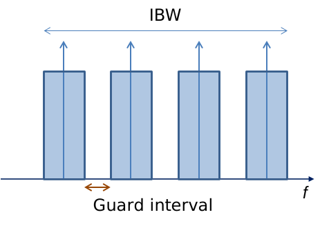
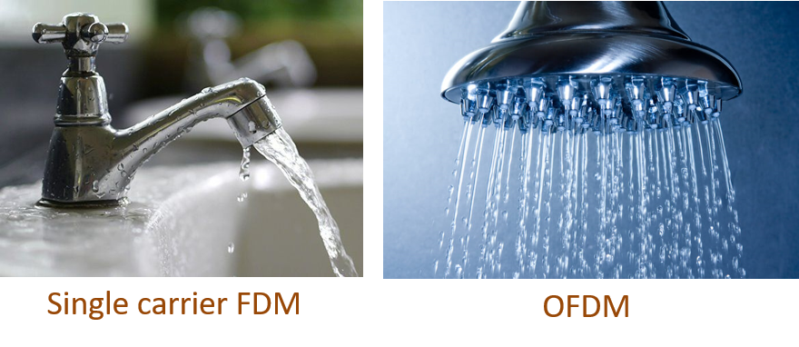
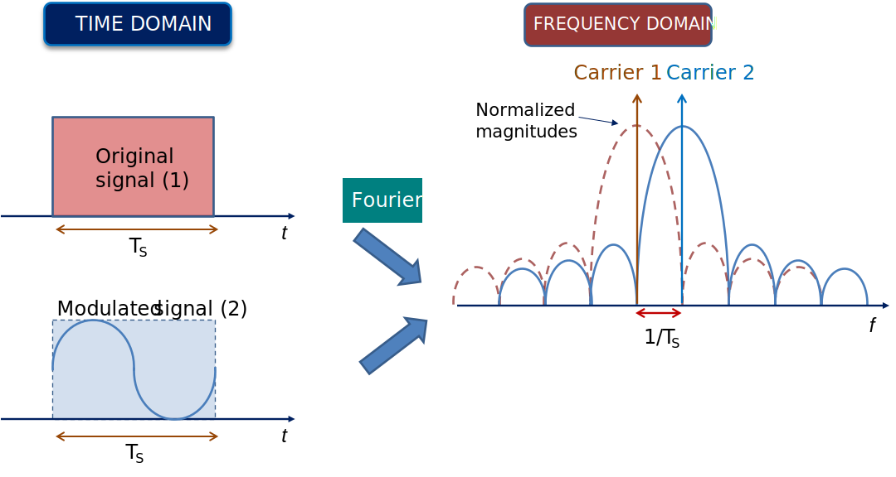
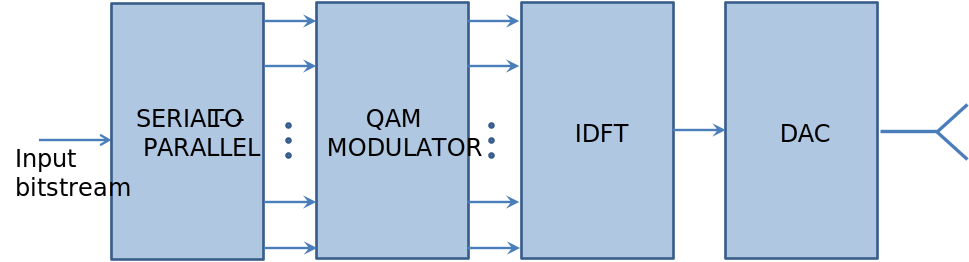
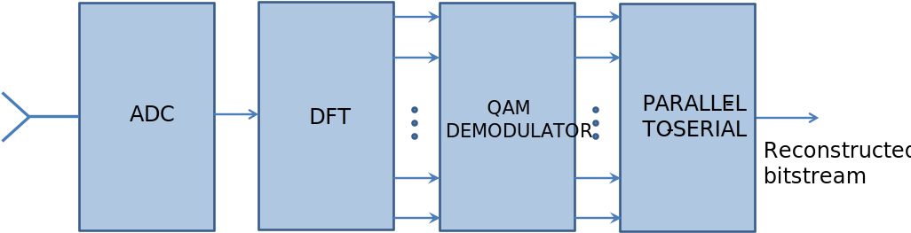

OFDM
======

Orthogonal frequency division multiplexing (OFDM) is an extension of the frequency division multiplexing (FDM) technique, though it is sometimes referred to as multicarrier modulation technique as well. The fundamental principle of classic FDM is to divide the available bandwidth into many narrow sub-bands and to use a number of parallel carriers within the available bandwidth to transfer the information. These parallel carriers possess guard intervals to prevent spectrum overlap and are strictly separated from each other, by which data integrity is preserved. This is a traditional approach and has been used in analog and digital transmission systems such as radio broadcasting, fixed telephony, GSM, etc.

  Fig. 1. Traditional frequency division multiplex 

   ..

On the other hand, the basic idea of OFDM (used e.g. in 4G mobile networks) is to allow the carriers within the spectrum to overlap, and to have an even larger number of narrow-band subcarriers within the allowed spectrum. The high-speed data sequence is parallelized and transferred at lower speeds at each subcarrier. That way, demands on the modulation procedure are relaxed while the total data rate remains high. An illustrative comparison between FDM and OFDM is given in Fig. 2.

  Fig. 2. Analogy between data stream and water stream

   ..

To get into the workings of OFDM, let's first note that a rectangular signal of unit amplitude and duration :math:`T_S` has the frequency spectrum of the form of the *sinc* function: 

.. math::
   T_S\cdot \frac{\sin \left (\pi f T_S  \right )}{\pi f T_S} 

The property of such function it that it consists of a main lobe (around frequency zero) and sidelobes, and that zeros in frequency domain occur at each :math:`\Delta f=\frac{1}{T_S}`.

We now modulate the signal by multiplying it with a complex exponential :math:`e^{-j \frac{2\pi}{T_{S}}t}`. Its frequency spectrum will shift by :math:`\frac{1}{T_{S}}`. Now, the main lobe of the modulated signal occurs at the frequency where the spectrum of the original signal was zero. This principle is illustrated in Fig. 3. A similar effect would occur if modulation was done for any integer multiple of :math:`\frac{1}{T_{S}}`. 

  Fig. 3. The principle of spectrum overlapping without interference for two subcarriers.

   ..

To apply this onto signals containing actual data, let's take a QAM-modulated symbol :math:`S_a` with its own amplitude and phase: :math:`S_a=S_0 \cdot e^{j\varphi_0 }`. This symbol can be modulated to a sub-carrier frequency :math:`f_\textrm{sc}`, and presented as a subcarrier :math:`s_a(t)`.

.. math::
   s_a\left ( t \right )=S_a \cdot e^{j2\pi f_\textrm{sc} t}

The duration of the symbol is :math:`T_S`, which we can observe as if the signal has been windowed by a rectangular pulse of duration :math:`T_S`. That way, the spectrum of a subcarrier will still have a *sinc* shape, with zeros at :math:`\frac {k} {T_S}` for any integer *k*.

Now, we can take as many such subcarriers and place them at a distance :math:`\Delta f = \frac{k}{T_S}` and be sure that they will not interfere with each other. The resulting signal with *N* subcarriers is then

.. math::
   s\left(t\right)=\frac{1}{N}\sum_{k=0}^{N-1}S_k\cdot  e^{j \frac{2\pi k}{T_S}t}  

The normalization factor :math:`1/N` is added for convention. The data in this signal is contained at discrete frequency points :math:`\Delta f = \frac{k}{T_S}`. We can sample this signal at :math:`t_s=\frac{T_S}{N}` to obtain a discrete signal

.. math::
   s_n=\frac{1}{N}\sum_{k=0}^{N-1}S_k\cdot  e^{j \frac{2\pi k}{N}n}

We recognize this as :ref:`Inverse DFT`. The continuous signal :math:`s(t)` and its discrete counterpart :math:`s_n` are both referred to as an **OFDM symbol**. IDFT and DFT are the primary method of assembling and, respectively, disassembling an OFDM symbol. The receiver will thus be performing DFT, to find the symbol as

.. math::
   S_k=\sum_{n=0}^{N-1}s_n\cdot e^{-j \frac{2\pi n}{N}k}

Discussion
   ..

- The spectrum of an OFDM symbol consists of *N* *sinc* functions separated by :math:`\Delta f=f_\textrm{sc}=\frac{k}{T_S}` in frequency. The main lobe of each *k*-th component is present at a frequency point where all other components are at zero amplitude. This is a generalization of the situation in Fig. 3.
- The total spectrum occupies the bandwidth of :math:`N \cdot \Delta f`. The duration of the OFDM symbol :math:`T_S` determines the *frequency resolution* :math:`\Delta f=\frac{1}{T_S}`. The larger the OFDM duration, the better the frequency resolution.
- The duration of the OFDM symbol is relatively large, meaning that each subcarrier exhibits a rather low data rate. However, the total data rate is still large as the information at multiple subcarriers is transferred in parallel during the same time frame :math:`T_S`. The lower data rate in subcarriers relaxes the demand on their modulation, so we may use a less complex modulation technique such as QPSK or 16-QAM.

The principal schematic of an OFDM transmitter is given in Fig. 4. The input bitstream is parallelized into *N* chunks, each of which will adhere to a certain subcarrier in an OFDM symbol. The method of mapping these chunks onto subcarriers is usually defined by a standard. These chunks are then mapped to a QAM symbol to assign them with amplitude and phase as defined by QAM symbol mapping. The obtained QAM symbols are inputs to an IDFT block. The ouput of this block is an OFDM symbol, which can then be converted by a DAC to analog domain.

   Fig. 4. Basic block schematic of an OFDM transmitter.

   ..

At the receiver side, inverse steps are performed, as seen in Fig. 5. Input analog signal is digitized and DFT is performed. The frequency coefficients, which are sampled at the correct frequencies of all subcarriers, are given as input to QAM demodulators. The output information is serialized by applying the mapping determined by the standard.

   Fig. 5. Basic block schematic of an OFDM receiver.

   ..

Channel Effects
----------------
The described process of obtaining, transferring and decoding an OFDM signal would work only in an ideal scenario. Realistically, when the signal is transferred through a real channel, the noise and interference from the channel will be added to the OFDM signal to produce a distorted signal. There are several methods to combat these effects.

Mitigating Dispersion
^^^^^^^^^^^^^^^^^^^^^^^^
Multipath propagation results in dispersion of OFDM symbol. Just as an echo, the signal will arrive to the receiver via multiple paths, and finally add up at the receiver. To solve this problem, a *guard interval* can be used. This interval can be filled up with a blank signal, or something other. Commonly, guard interval is composed by copying the ending segment of the OFDM symbol (in time domain) and appending it to the start of the symbol. Normally, 10% to 25% of the symbol is copied. This method is termed **cyclic prefix**.

Although it results in prolonged duration of the OFDM symbol, it is successful in shielding the signal from dispersion. It also adds some redundancy to the signal. The presence of a cyclic prefix will not interfere with DFT, short of adding some common phase shift to all subcarriers. This property is also useful when attempting to synchronize the receiver to the start of an OFDM symbol.

Channel Equalization
^^^^^^^^^^^^^^^^^^^^^
Every channel acts as a filter. It can be measured and its response plotted as amplitude and phase response. As a typical OFDM signal is rather wide in bandwidth, channel characteristic can significantly degrade it. Equalization should be performed at the receiver to revert the signal to its original state.

To measure the channel characteristic, some subcarriers are populated with a predefined pseudorandom sequence. These subcarriers can be placed at frequency points that we define by the standard. They are called **pilots**. Their purpose is to present the channel characteristic to the receiver, as they will be distorted the same way as any other data subcarrier would. The receiver can use this information to interpolate the channel response.

Once we have that information, the receiver will produce an inverse filter to cancel out the channel distortion that the signal has suffered.

Related Assignments
--------------------
This chapter is accompanied by a demo example :ref:`OFDM symbol generator <ofdm-generator>` and a self-study assignment :ref:`OFDM symbol demodulator <ofdm-demodulator>`.
