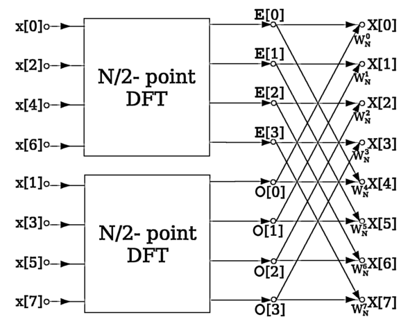

Signals and Their Representations
===================================

A signal is a series of values spread out in time or any other domain. It can represent a non-physical quantity (e.g. a sequence of random numbers) or it can be a representation of a physical quantity (e.g. temperature or velocity). Signals can be observed as information carriers. They are generated by transmitters, received by receivers and processed by systems.

.. figure:: _img/signal/sound.png

   Fig. 1. A digitized sound signal.

In signal processing, we observe signals in time and frequency domain. While time domain naturally explains the content of the signal by a progressing series, frequency domain allows us to present the signal in terms of frequency components that the signal is composed of. Different operations of the **Fourier analysis** allow us to convert between the two domains, depending on the nature of the observed signal.

+---------------------+-------------------------+----------------------+
|  Time domain        |  Transform              |  Frequency domain    |
+=====================+=========================+======================+
|  Continuous         |  Fourier transform      |  Continuous          |
|  Non-periodic       |                         |  Non-periodic        |
+---------------------+-------------------------+----------------------+
|  Continuous         |  Fourier series         |  Discrete            |
|  Periodic           |                         |  Non-periodic        |
+---------------------+-------------------------+----------------------+
|  Discrete           |  Discrete-time          |  Continuous          |
|  Non-periodic       |  Fourier transform      |  Periodic            |
+---------------------+-------------------------+----------------------+
|  Discrete           |  Discrete Fourier       |  Discrete            |
|  Periodic           |  transform  (DFT)       |  Periodic            |
+---------------------+-------------------------+----------------------+

From this table, we see that a continuous signal will have a non-periodic frequency spectrum. The *non-periodicity* can in fact be interpreted as infinitude of the signal. On the other hand, a time-periodic signal can be considered finite in its definition.

For any signal processing purposes, signals can be viewed as discrete because the computer represents them as a series of numbers. Further, since the signals are finite in computer representation, we can analyze them by virtually repeating them, thus creating a periodic signal. This makes their frequency spectrum discrete as well, and enables us to analyze the signal in a computer in both domains.

Discrete Fourier Transform
----------------------------

At this point, it is clear that Discrete Fourier transform (DFT) is the appropriate method for analyzing a signal represented in a computer. So let's briefly review the theory on DFT.

For any given time-discrete signal :math:`x_n`, it's DFT series :math:`X_k` is given as:

.. math::
   X_k = \sum_{n=0}^{N-1} x_n \cdot e^{-i \frac{2\pi}{N} k n}

Note the complex exponential (:math:`e^{i}`) in the formula. The result will be a complex number, which can generally be written in a polar notation :math:`R \cdot e^{i \phi}`. From this, we see that the spectrum can be separated into its amplitude component (:math:`R`) and its phase component (:math:`\phi`). An example of such spectrum is shown in Figure 2.

.. figure:: _img/signal/dft.png

   Fig. 2. An example of a rectangular signal and the corresponding *sinc* amplitude spectrum.

Consider the following:

Spectrum is discrete
   As a result of time-periodicity of the signal (or its finitude), the spectrum is defined at discrete points *k*. These points are commonly referred to as *bins*. 

Signal is discrete ...
   ... and we therefore know exactly what the maximum frequency a signal may contain. Periodic spectra use normalized frequency domain, defined in the range :math:`\Omega \in [-\pi, \pi]`. Spectrum is periodic. Therefore, it may be wrapped around, should that simplify analysis. Therefore, definition of :math:`\Omega \in [0, 2\pi]` is just as valid.

Note that the amplitude spectrum, as seen in the above image, would be the same for a rectangular signal that is offset on the time scale. This is because the time-offset information is carried in the phase of the spectral components.

   Fig. 3. Two time-offset rectangular signals and their corresponding phase spectra.

Inverse DFT
^^^^^^^^^^^^

For any given discrete spectrum :math:`X_k`, the corresponding time-discrete signal :math:`x_n` is found as:

.. math::
   x_n = \frac{1}{N} \sum_{k=0}^{N-1} X_k \cdot e^{i \frac{2\pi}{N} k n}

Fast Fourier Transform
^^^^^^^^^^^^^^^^^^^^^^^

A widely used algorithm for calculating DFT is the *Fast Fourier Transform* (FFT). It operates on the principle of factorizing the DFT problem into multiple DFT tasks of lesser complexity, and then recursively running the algorithm. The basic principle is presented in the diagram in Figure 4.

   Fig. 4. An example of an FFT algorithm. Source: `Wikimedia Commons <https://commons.wikimedia.org/wiki/File:DIT-FFT-butterfly.png>`_.

Complex Signals
-------------------
So, as we've seen by an example of two time-offset signals, spectrum of a signal is made up of complex numbers. The same way, a signal can be either real or complex. While it is easy to understand how a signal can be mathematically represented by a complex number, the real-life utilization of such concept might not be evident. But let's take one step at a time.

Samples of a complex signal are made up of real and imaginary part. In signal processing, a complex signal is viewed as a pair of those real-valued series. While this concept may not seem advantageous right away, let's consider the spectrum of a complex signal.

You may have noticed in our first figure, the amplitude spectrum of a rectangular signal was symmetric around the :math:`Ω=0` axis. Similarly, the phase spectra of the two exemplary rectangular signals later on were centrally symmetric against the :math:`(0,0)` point. This property is valid for all real signals, i.e. signals composed of a series of single real values. Strictly speaking, for a real signal :math:`s(t)`, its Fourier transform :math:`S(f)` has Hermitian symmetry around :math:`f=0`, so that :math:`S(-f) = S^*(f)`. Complex signals do not have this constraint, and spectrum can be freely determined for positive and negative frequencies alike.

Extreme examples of how to utilize this property are *analytic signals*. These are constructed from a real signal prototype, with aim to completely remove their negative-frequency spectrum. For a prototype signal :math:`s(t)` and its Fourier transform :math:`S(f)`, the corresponding analytic signal is found by manipulating the spectrum as

.. math::
   S_a(f) = S(f) + sgn(f) \cdot S(f)

We then find the analytic signal by inverse Fourier transform as

.. math::
   s_a(t) = s(t) + j\hat{s}(t)
          = s(t) + j \left[ \frac{1}{\pi t} * s(t) \right]

The :math:`\hat{s}(t)` is the `Hilbert transform <https://en.wikipedia.org/wiki/Hilbert_transform>`_ of :math:`s(t)`.

Analytic signals are an extreme example of complex signals. In general (and in practice) the imaginary part of a complex signal will not be a Hilbert transform of its real part. The two components will form a complex signal which has spectral components on both the left and the right side of the frequency axis.

.. note::
   Since they consist of two independent components, complex signals double the information relayed through one signal, when compared to real signals. With complex signals, we *unlock* the left-hand side of the frequency axis, effectively doubling the information capacity in spectral domain as well.

Related Assignments
--------------------
This chapter is accompanied by a demo example :ref:`A Sampled Spectrum <a-sampled-spectrum>`.
