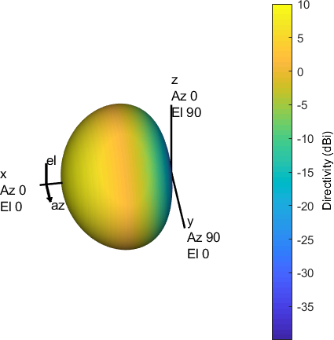
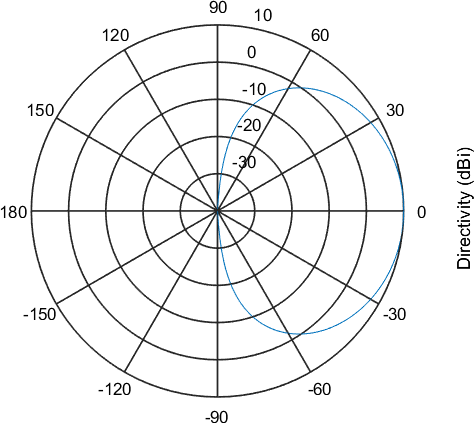

Designing Antenna Arrays
=========================

**Assignment 05**

You are given a task to design two antenna arrays with a goal of directing the radiation pattern toward a number of predefined targets. The first array you design is a linear array, with its elements placed along a line. You determine the y coordinate of each antenna element. The second array will be a planar array, with its elements placed on the zy plane, and the coordinates of the elements determined by you.

   Fig. 1. Coordinate system

   ..

For each of the two antenna arrays, you are given several scenarios that determine in which direction the target is placed. For the linear array, the target will be offset only in azimuthal direction, while for the planar array, the target will be offset in both azimuth and elevation. Your job is to provide the beamforming coefficients for each of the scenarios that focus the radiation pattern toward the target, with the antenna array that you designed.

The signal you're using is narrowband, with a central frequency of 30 GHz.

Array element
^^^^^^^^^^^^^^

To make things more interesting, you will not be working with isotropic elements, rather with an antenna element of predefined radiation pattern. The pattern is given by a formula, and presented by a diagram. Here, :math:`\phi` is the azimuth angle, and :math:`\theta` is the elevation angle.

.. math::
   D(\phi,\theta) = cos^2(\theta)

   
   Fig. 2. 3D radiation pattern
   
   ..

   Fig. 3. Radiation pattern cut

   ..

Linear Array
^^^^^^^^^^^^^^

Design a single linear antenna array, with elements placed along the y axis, within the beamformer area designated in Fig. 1. The array should be designed to achieve the best directivity between the antenna array and the target for the following scenarios:

Scenario 1
   The target is directly in front of the antenna array.

   .. figure:: _img/scenario1.png

      Fig. 4. Drawing of Scenario 1

Scenario 2
   The target is located along the longitudinal (y) axis of the antenna array, at an elevation of 30°.

   .. figure:: _img/scenario2.png

      Fig. 5. Drawing of Scenario 2

Scenario 3
   The target is located along the longitudinal (y) axis of the beamforming system, at an elevation of 60°.

   .. figure:: _img/scenario3.png

      Fig. 6. Drawing of Scenario 3

Scenario 4
   The target is located along the longitudinal (y) axis of the beamforming system, at an elevation of 70°.

   .. figure:: _img/scenario4.png

      Fig. 7. Drawing of Scenario 4

Planar Array
^^^^^^^^^^^^^^

Design a single planar antenna array, with elements placed in the yz plane, within the beamformer area designated in Fig. 1. The array should be designed to achieve the best directivity between the antenna array and the target for the following scenario:

Scenario 5
   The target is located at an azimuth of 45° and elevation of 60° from the antenna array.

   **Note:** Be sure to check the coordinate system setup in Fig. 1.

Output Data
^^^^^^^^^^^^^^

Your solution as a MATLAB or Python script.

elements1.csv
   The file contains a one-dimensional array representing the positions of antenna elements along the y axis in meters.
	
scenarioX.csv
   e.g. *scenario1.csv*, ...
   The file contains a one-dimensional array of complex numbers representing the weights applied to each antenna element. Weights are given for elements in the same order as they are listed in *elements1.csv*. Array length is equal to the number of elements in the beamforming system. All numbers are inside, or at the edge of the unit circle.

elements2.csv
   The file contains a two-dimensional array representing the positions of antenna elements in the xy plane in meters. The first column is the x coordinate, and the second column is the y coordinate.
	
scenario5.csv
   The file contains a one-dimensional array of complex numbers representing the weights applied to each antenna element. Weights are given for elements in the same order as they are listed in *elements2.csv*. Array length is equal to the number of elements in the beamforming system. All numbers are inside, or at the edge of the unit circle.
	
Complex numbers should be stored either in

- cartesian notation: `a+bi`, or `a+bj` or
- polar notation: `P*exp(Ri)`

Please delimit CSV data with a comma (`,`).

Evaluation and Grading
^^^^^^^^^^^^^^^^^^^^^^^

Your dataset will be processed in an evaluation system that simulates your antenna array with the given beamforming coefficients. A farfield diagram is calculated and evaluated at the target direction. Each scenario will be positively graded if the target is illuminated by the main lobe, up to 3 dB off its maximum directivity. A solution is valid if antenna arrays contain at least 4 elements.
